# 🩺 Simple Health Checker
A simple HTTP server that checks the health of multiple hosts and aggregates the result.  

```mermaid
graph TD
    client("client 💻")
    server(simple-health-checker)
    target1(target1)
    target2(target2)
    target3(target3)
    join((join))

    client --GET /health-->server
    server---join
    join --GET--> target1
    join --GET--> target2
    join --GET--> target3

    style join stroke-dasharray: 5 5
```


## 🧰 Tools
- Java 13
- Maven 3
- Docker 

## 📦 Installation 
From repository root, run the following command to build the image.
```bash
docker build -t <imageName> .
```
Run the following command to start the image on Docker.
```bash
docker run -d -p <hostPort>:<containerPort> <imageName>
```
- localhostPort - The port of the current host that is mapped to the container.
- containerPort - The container port to which there is a mapping from host's port.
- imageName - The name of the Docker image.

Example:
```bash
docker run -d -p 8999:5555 healthchecker
```
You can check the access to the container as follows:
```bash
curl localhost:8999/health
```

## ⚙ Configuration
To use the app and test the servers you need to edit the `application.properties` file. 

| property  | description  | example  |
|---|---|---|
|server.port |the port that the server will listen on   |  5555 |
|healthcheck.target | the endpoints that you want to check their health.<br />list format should be `<HOST1>;<NAME1>,<HOST2>;<NAME2>,...`| http://www.google.com:80;google,http://github.com:80;gitHub  |
| healthcheck.time  | health check time out in milliseconds  |  3000 |

In the application.properties file, add the server address that you want to check in a given format.

## 🧪 Tests
Unit test written with Junit 5 and Mockito.  
